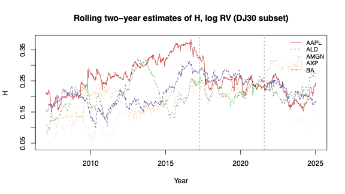
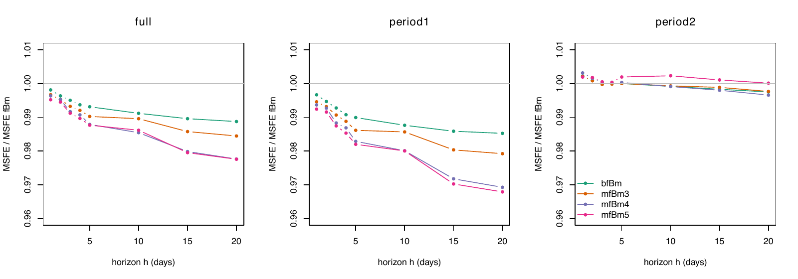
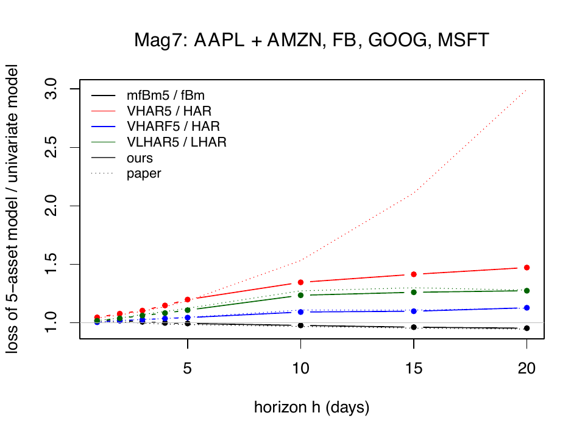
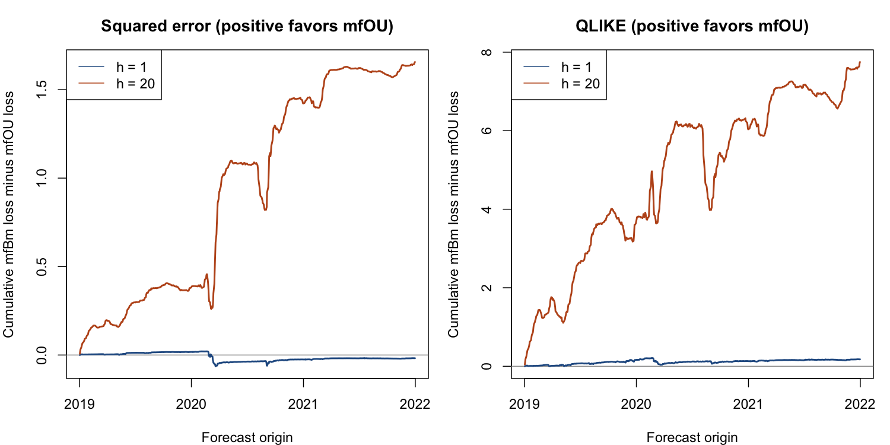

# Realized-volatility forecasting with mfBm and mfOU

This repository reproduces and extends Bibinger, Yu and Zhang (2026),
[*Modeling and Forecasting Realized Volatility with Multivariate Fractional Brownian Motion*](https://arxiv.org/abs/2504.15985)
(JBES).

The central question is whether the past realized volatility of other assets can
improve a forecast for a target asset. The paper predicts a gain when assets are
correlated and have different Hurst exponents. We reproduce the paper's estimation
and forecasting pipeline, test its robustness on alternative assets and windows,
and add two exploratory extensions: mean-reverting mfOU forecasts and data-driven
asset selection.

**Languages:** English (this page) · [Русская версия](README_RU.md)

**Detailed validation:** [final audit](docs/FINAL_AUDIT.md) ·
[paper coverage](docs/paper_coverage.csv) ·
[presentation guide](docs/PRESENTATION_GUIDE.md)

## Results at a glance

| Question | Main result | Interpretation |
|---|---:|---|
| Did we reproduce the parameter estimates? | 25/25 point estimates match Table 1 to four decimals; 23/25 standard errors match exactly | The estimation pipeline closely reproduces the paper |
| Does multivariate mfBm improve on univariate fBm? | DJ30 MSFE falls by 0.48% at `h=1`, 1.23% at `h=5`, and 2.24% at `h=20` | The gain is modest and grows with the forecast horizon |
| Is the result stable on Mag7? | mfBm5 is worse at very short horizons and becomes better at about `h=4` | Adding assets is not automatically beneficial |
| Does the estimation window matter? | At `h=20`, a 250-day window gives about 1.32 times the MSFE of the 500-day baseline for mfBm5 | A larger multivariate covariance structure needs enough history |
| Does adding mean reversion help? | At `h=20`, mfOU lowers MSFE by 12.2% and QLIKE by 9.2% versus mfBm; `h=1` is mixed | The mfOU extension is promising mainly at longer horizons |
| Can assets be selected more intelligently? | For AAPL, the H-gap rule loses at `h=1` but gains about 5.8% at `h=20` | Descriptive only: this comparison has 12 quarterly origins |

The forecasting numbers above compare matched forecasts for the same target dates.
They are not trading-profit or causal claims. Code C results are new exploratory
experiments and are **not** results reported in the paper.

## Visual summary

### 1. Replication: roughness changes through time

The rolling two-year estimates below reproduce the paper's main empirical pattern.
All estimated Hurst exponents remain below 0.5, but their cross-sectional differences
vary over time. They converge substantially during 2017–2021, when the theoretical
benefit from using other assets should become small.



Source: `results/figures/code_a_fig07_rolling_H_dj30.pdf`.

### 2. Replication: mfBm gains are concentrated at longer horizons

The figure reports `MSFE(model) / MSFE(univariate fBm)`. Values below one favor the
multivariate model. The full sample and the first subperiod show gradually larger
gains as the horizon grows. In the 2017–2021 convergence period, the ratios stay
close to one, consistent with the theory.



Source: `results/figures/code_b_fig_dj30_msfe_ratio.pdf`.

### 3. Robustness: Mag7 does not improve at every horizon

On the available Magnificent 7 panel, larger mfBm systems underperform at the
shortest horizons and improve only after the horizon increases. This is a useful
counterexample to the claim that adding more related assets must always help.

<p align="center">
  
</p>

Source: `results/figures/code_b_fig_mag7_class_ratio.pdf`.

### 4. Extension: mfOU is promising at the 20-day horizon

mfOU adds a mean-reversion parameter to the rough multivariate model. The lines
below are cumulative matched loss differences, `loss(mfBm) - loss(mfOU)`, so a
positive value favors mfOU. The one-day comparison remains near zero, whereas the
20-day advantage accumulates across the evaluation period.



For AAPL over 2019–2021, the dense study contains 750 paired forecasts. At `h=20`,
mfOU reduces MSFE by 12.18% and QLIKE by 9.21%; the exploratory block-bootstrap
intervals exclude zero. At `h=1`, MSFE changes by -0.39% and QLIKE by +0.89%, so
there is no clear short-horizon winner. Full results and definitions are in
[Code C results](code_c/RESULTS_EN.md).

### 5. Extension diagnostics: parameter estimates are time-varying

Both roughness and fitted mean reversion change through time. Because the mfOU
optimization constrains the mean-reversion parameter to be positive, a positive
estimate alone is not proof of true mean reversion. The simulation study also shows
that slow mean reversion is difficult to estimate precisely.


## Scope of the repository

- **Code A** reproduces the mfBm covariance structure, moment estimators,
  time-reversibility test, empirical parameter estimates, and Monte Carlo exercises.
- **Code B** reproduces the theoretical forecasting figures and implements rolling
  mfBm/HAR forecasts on the authors' DJ30 and Mag7 panels.
- **Code C** contains the exploratory extensions: stationary mfOU forecasting,
  window-length sensitivity, known-versus-estimated simulation, and asset selection.

### What is reproduced, and what is not

| Part | Status | Evidence |
|---|---|---|
| Table 1 point estimates | Exact to four decimals, 25/25 cells | [`code_a_table01_estimates.csv`](results/tables/code_a_table01_estimates.csv) |
| Table 1 standard errors | 23/25 exact; two differ by 0.0001 because of series truncation | [`code_a_table01_se_check.csv`](results/tables/code_a_table01_se_check.csv) |
| Appendix Monte Carlo | 290/316 cells within two combined Monte Carlo standard errors | [`code_a_mc_agreement_summary.csv`](results/tables/code_a_mc_agreement_summary.csv) |
| Figures 1–7 and forecast formulas | Reproduced or implemented | [`results/figures`](results/figures), tests, [`paper_coverage.csv`](docs/paper_coverage.csv) |
| Table 2 forecasting pattern | Close for the full sample and period 1 | [`results/tables`](results/tables) |
| Table 2 period-2 levels | **Not exact**: most losses remain about 6–9% above the paper, although model ratios agree | [`response_to_review_B.md`](docs/response_to_review_B.md) |
| Table 3 / vector HAR levels | Reproducible, but positivity filtering makes some QLIKE values unstable | [`response_to_review_B.md`](docs/response_to_review_B.md) |
| mfOU and asset-selection experiments | New exploratory results, not paper replication | [`code_c/RESULTS_EN.md`](code_c/RESULTS_EN.md) |

The primary missing-day convention is the **trading calendar**: missing observations
retain their positions in time. `common_obs` outputs are preserved as a sensitivity
calculation. The paper does not fully specify this rule, so both conventions are
reported instead of silently selecting the one closest to a published table.

## Interpretation and limitations

- Another asset is useful in the mfBm theory only when dependence is nonzero and its
  Hurst exponent differs from that of the target asset.
- Better performance at `h=20` does not imply better performance at `h=1`.
- Non-rejection of time reversibility is not proof that the asymmetry parameter is
  exactly zero.
- A positive fitted mfOU mean-reversion rate is not by itself evidence of true mean
  reversion; the parameter is constrained during optimization.
- The period-2 loss levels and some vector-HAR QLIKE values do not exactly reproduce
  the paper and are disclosed rather than hidden.
- The mfOU confidence intervals are exploratory, and the selection experiment is
  especially small. These extensions should be validated on more assets and dates.

## Requirements and setup

- R 4.3 or newer (the saved runs used R 4.5–4.6)
- CRAN package `testthat` for tests
- Base R is sufficient for the estimation and forecasting pipelines

From the repository root:

```bash
Rscript scripts/setup_environment.R
Rscript scripts/run_tests.R
Rscript code_c/scripts/run_tests.R
```

The processed data snapshot is committed. Expected MD5 values are recorded in
`data/processed/MD5SUMS`. To rebuild it from Risk Lab instead, run:

```bash
Rscript scripts/01_download_data.R
Rscript scripts/02_prepare_data.R
```

## Reproducing the results

Quick end-to-end check:

```bash
Rscript scripts/run_all.R smoke
```

Paper pipeline using the committed data:

```bash
Rscript scripts/run_all.R paper
```

This runs the non-Monte-Carlo Code A checks and the full Code B forecasts. The full
Code A Monte Carlo is separate because it is computationally expensive:

```bash
Rscript scripts/04_run_monte_carlo.R full
Rscript scripts/04b_compare_mc_with_paper.R full
```

Code C examples and executed-study settings:

```bash
Rscript code_c/scripts/run_experiments.R smoke all
Rscript code_c/scripts/run_experiments.R study mfou --dimensions=1,2 --sensitivity=none --study-step=1 --output=results/code_c_v2/dense_study
Rscript code_c/scripts/run_experiments.R study mfou --study-step=63 --output=results/code_c_v2/window_study
Rscript code_c/scripts/run_experiments.R study selection --study-step=63 --output=results/code_c_v2/selection_study
Rscript code_c/scripts/run_experiments.R study simulation --output=results/code_c_v2/simulation_study
```

The complete daily Code C grid over every dimension and window was **not** run. The
included outputs distinguish the dense two-dimensional study from the sparse window
and selection studies. The 12-origin selection results should not be presented as a
confirmatory test.

## Repository map

```text
R/                         Code A/B implementation
scripts/                   A/B pipelines and integrated runners
tests/testthat/            A/B tests
code_c/                    additive mfOU and asset-selection extensions
data/processed/            pinned log-volatility panels and checksums
results/tables/            generated numerical results
results/figures/           generated paper and forecast figures
docs/readme_assets/        figures displayed on this page
docs/paper_values/         values transcribed from the article
docs/paper_coverage.csv    table/figure-by-table/figure coverage
docs/FINAL_AUDIT.md        claims, discrepancies, and limitations
docs/PRESENTATION_GUIDE.md real figures and presentation interpretation
```

## Reproducibility notes

- All rolling forecasts are trained only on observations available at the origin.
- Forecast comparisons use identical target keys and realized outcomes.
- Code B records calendar, positivity, uniqueness, and no-look-ahead checks.
- Code C records source/data hashes, failures, parameter boundaries, and numerical
  diagnostics; its saved baseline hashes match the integrated A/B sources.
- `eta` has two sign conventions in the printed paper/code. The implementation exposes
  both; the time-reversibility test is unaffected by the sign choice.
- Model Confidence Set p-values are random-bootstrap quantities. Exact values depend
  on the seed; the implementation was independently compared with NumPy and the
  `arch` package in `docs/review_B/`.
