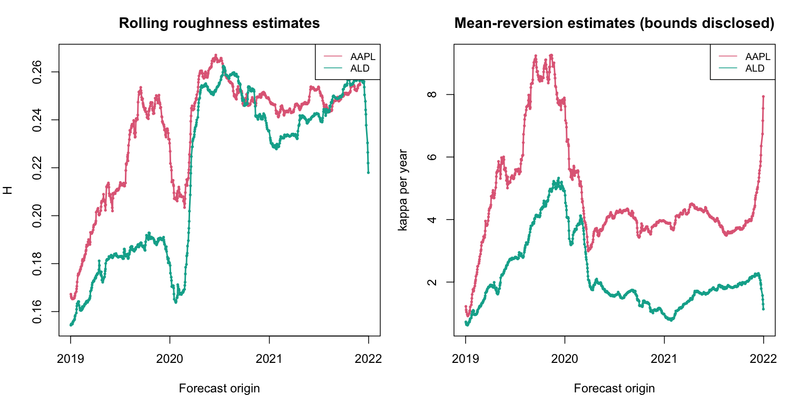

# Code C v2: executed empirical report

Mode: study . Actual target dates: 2019-01-03 to 2022-01-31 . Calendar: trading.
Scheduled origins: 751 ; generated forecast rows: 24000 ; mfOU failures: 0 .

## Scope

Smoke proves execution only. This study uses prespecified origins every 1 trading day(s), within 2019-01-02 to 2021-12-31; it is not the full daily paper period. Inference is pointwise exploratory, with paired calendar blocks and no multiple-testing correction.
Sparse or short samples receive no confidence intervals. Numerical gains below are descriptive; negative gains are retained. Baseline and mfOU losses use their exact shared keys; raw baseline forecasts and all failures remain available.

## Main 500-day comparison

| dimension | h | metric | n | gain_pct | uncertainty_status |
| --- | --- | --- | --- | --- | --- |
| 1 |  1 | MSFE | 750 | -0.390 | exploratory_pointwise |
| 1 |  1 | QLIKE | 750 |  0.894 | exploratory_pointwise |
| 1 | 10 | MSFE | 750 |  3.970 | exploratory_pointwise |
| 1 | 10 | QLIKE | 750 |  3.604 | exploratory_pointwise |
| 1 | 20 | MSFE | 750 | 12.175 | exploratory_pointwise |
| 1 | 20 | QLIKE | 750 |  9.210 | exploratory_pointwise |
| 2 |  1 | MSFE | 750 | -0.528 | exploratory_pointwise |
| 2 |  1 | QLIKE | 750 |  0.876 | exploratory_pointwise |
| 2 | 10 | MSFE | 750 |  3.892 | exploratory_pointwise |
| 2 | 10 | QLIKE | 750 |  3.595 | exploratory_pointwise |
| 2 | 20 | MSFE | 750 | 12.236 | exploratory_pointwise |
| 2 | 20 | QLIKE | 750 |  9.364 | exploratory_pointwise |

## Estimation diagnostics

Boundary parameter rows: 0 of 2250 .
A boundary or a poorly conditioned local moment Jacobian signals weak identification; it does not prove mean reversion. Conditional log variance is plug-in and excludes parameter uncertainty.

## Files

metrics.csv includes MSFE, RMSFE and QLIKE by model, horizon and prespecified paper subperiod. window_sensitivity.csv intersects keys before comparing training lengths. cumulative_loss.csv and figures retain the direction of every outcome. parameters.csv and estimation_failures.csv expose numerical/estimation limits.

Scientific definition and references: code_c/docs/METHODS_EN.md and METHODS_RU.md. No independent acceptance is asserted.
