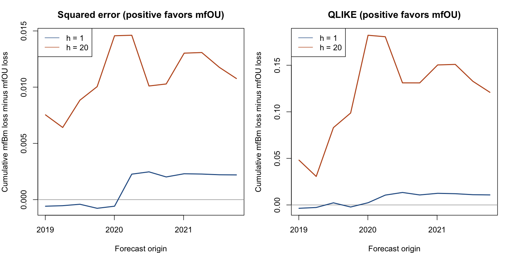
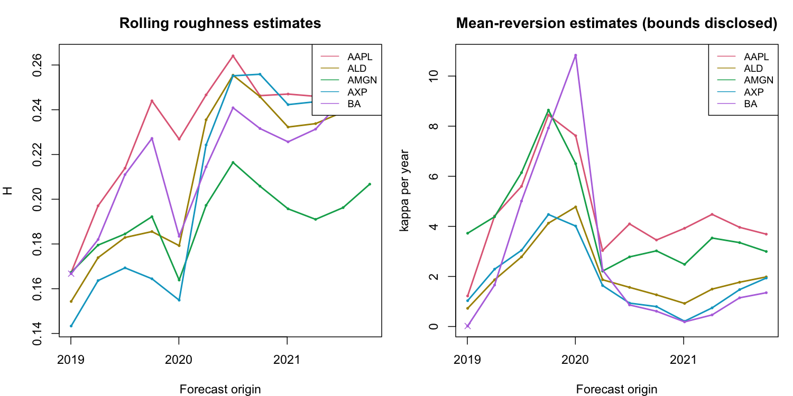

# Code C v2: executed empirical report

Mode: study . Actual target dates: 2019-01-03 to 2021-11-05 . Calendar: trading.
Scheduled origins: 12 ; generated forecast rows: 1728 ; mfOU failures: 0 .

## Scope

Smoke proves execution only. This study uses prespecified origins every 63 trading day(s), within 2019-01-02 to 2021-12-31; it is not the full daily paper period. Inference is pointwise exploratory, with paired calendar blocks and no multiple-testing correction.
Sparse or short samples receive no confidence intervals. Numerical gains below are descriptive; negative gains are retained. Baseline and mfOU losses use their exact shared keys; raw baseline forecasts and all failures remain available.

## Main 500-day comparison

| dimension | h | metric | n | gain_pct | uncertainty_status |
| --- | --- | --- | --- | --- | --- |
| 1 |  1 | MSFE | 12 |  5.503 | unavailable_sparse_or_insufficient_blocks |
| 1 |  1 | QLIKE | 12 |  4.264 | unavailable_sparse_or_insufficient_blocks |
| 1 | 10 | MSFE | 12 | 36.855 | unavailable_sparse_or_insufficient_blocks |
| 1 | 10 | QLIKE | 12 | 17.936 | unavailable_sparse_or_insufficient_blocks |
| 1 | 20 | MSFE | 12 | 15.488 | unavailable_sparse_or_insufficient_blocks |
| 1 | 20 | QLIKE | 12 | 14.544 | unavailable_sparse_or_insufficient_blocks |
| 2 |  1 | MSFE | 12 |  5.519 | unavailable_sparse_or_insufficient_blocks |
| 2 |  1 | QLIKE | 12 |  4.077 | unavailable_sparse_or_insufficient_blocks |
| 2 | 10 | MSFE | 12 | 37.140 | unavailable_sparse_or_insufficient_blocks |
| 2 | 10 | QLIKE | 12 | 18.163 | unavailable_sparse_or_insufficient_blocks |
| 2 | 20 | MSFE | 12 | 14.402 | unavailable_sparse_or_insufficient_blocks |
| 2 | 20 | QLIKE | 12 | 13.733 | unavailable_sparse_or_insufficient_blocks |
| 3 |  1 | MSFE | 12 |  6.134 | unavailable_sparse_or_insufficient_blocks |
| 3 |  1 | QLIKE | 12 |  4.448 | unavailable_sparse_or_insufficient_blocks |
| 3 | 10 | MSFE | 12 | 38.010 | unavailable_sparse_or_insufficient_blocks |
| 3 | 10 | QLIKE | 12 | 18.200 | unavailable_sparse_or_insufficient_blocks |
| 3 | 20 | MSFE | 12 | 13.396 | unavailable_sparse_or_insufficient_blocks |
| 3 | 20 | QLIKE | 12 | 12.848 | unavailable_sparse_or_insufficient_blocks |
| 4 |  1 | MSFE | 12 |  5.722 | unavailable_sparse_or_insufficient_blocks |
| 4 |  1 | QLIKE | 12 |  4.118 | unavailable_sparse_or_insufficient_blocks |
| 4 | 10 | MSFE | 12 | 38.849 | unavailable_sparse_or_insufficient_blocks |
| 4 | 10 | QLIKE | 12 | 18.932 | unavailable_sparse_or_insufficient_blocks |
| 4 | 20 | MSFE | 12 | 13.209 | unavailable_sparse_or_insufficient_blocks |
| 4 | 20 | QLIKE | 12 | 12.867 | unavailable_sparse_or_insufficient_blocks |
| 5 |  1 | MSFE | 12 |  7.403 | unavailable_sparse_or_insufficient_blocks |
| 5 |  1 | QLIKE | 12 |  5.236 | unavailable_sparse_or_insufficient_blocks |
| 5 | 10 | MSFE | 12 | 41.587 | unavailable_sparse_or_insufficient_blocks |
| 5 | 10 | QLIKE | 12 | 20.416 | unavailable_sparse_or_insufficient_blocks |
| 5 | 20 | MSFE | 12 | 13.817 | unavailable_sparse_or_insufficient_blocks |
| 5 | 20 | QLIKE | 12 | 13.731 | unavailable_sparse_or_insufficient_blocks |

## Estimation diagnostics

Boundary parameter rows: 11 of 324 .
A boundary or a poorly conditioned local moment Jacobian signals weak identification; it does not prove mean reversion. Conditional log variance is plug-in and excludes parameter uncertainty.

## Files

metrics.csv includes MSFE, RMSFE and QLIKE by model, horizon and prespecified paper subperiod. window_sensitivity.csv intersects keys before comparing training lengths. cumulative_loss.csv and figures retain the direction of every outcome. parameters.csv and estimation_failures.csv expose numerical/estimation limits.

Scientific definition and references: code_c/docs/METHODS_EN.md and METHODS_RU.md. No independent acceptance is asserted.
